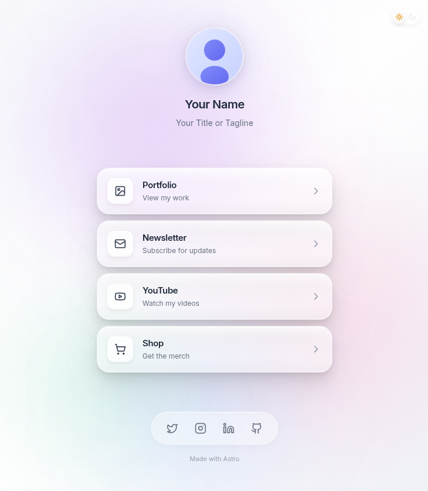
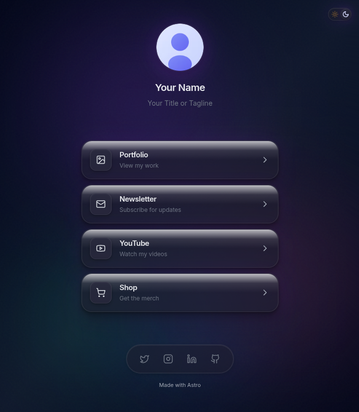

# Astro Link-in-Bio Template

A stunning, performant link-in-bio page built with **Astro 6 Beta**, **Tailwind CSS v4**, and pure CSS glassmorphism effects. Zero JavaScript runtime overhead—just beautiful, animated static HTML.


---

## Preview

| Light Mode | Dark Mode |
|:----------:|:---------:|
|  |  |

---

## Features

- **Glassmorphism Design** — Frosted glass cards with layered shadows and backdrop blur
- **Dark/Light Mode** — System preference detection + manual toggle, no flash on load
- **Animated Background** — Floating gradient orbs with smooth keyframe animations
- **Responsive** — Mobile-first design that looks great on all devices
- **SEO Optimized** — Open Graph, Twitter Cards, JSON-LD structured data
- **Content Security Policy** — Built-in CSP headers for security
- **Staggered Animations** — Elements fade in with calculated delays
- **~3KB Profile Image** — Auto-optimized AVIF/WebP with Astro's Picture component
- **Zero JS Bundle** — Only inline script for theme detection (no runtime overhead)

---

## Quick Start

```bash
# Clone the template
git clone https://github.com/your-username/astro-link-in-bio.git
cd astro-link-in-bio

# Install dependencies
pnpm install

# Start development server
pnpm dev
```

Open [localhost:4321](http://localhost:4321) in your browser.

---

## Customization

### 1. Your Profile

Edit `src/components/LinkBioPage.astro`:

```astro
<ProfileSection
  name="Your Name"
  bio="Your Title or Tagline"
  image={profileImage}
/>
```

Replace `src/assets/profile.svg` with your own image (PNG, JPG, SVG, etc.).

### 2. Your Links

Edit the `LinkCard` components in `src/components/LinkBioPage.astro`:

```astro
<LinkCard
  title="Your Link Title"
  description="Optional description"
  href="https://your-url.com"
>
  <svg slot="icon"><!-- Your SVG icon --></svg>
</LinkCard>
```

### 3. Social Icons

Edit `src/components/SocialFooter.astro` to add your social media links. Replace `#` with your URLs:

```astro
<a href="https://twitter.com/yourhandle" ...>
<a href="https://instagram.com/yourhandle" ...>
```

### 4. Site Metadata

Set the `SITE_URL` environment variable to your production domain (e.g., in Vercel/Netlify settings or a `.env` file). The configuration automatically uses this or falls back to localhost for development.

Edit `src/layouts/Layout.astro` for meta tags:

```astro
const siteName = "Your Name";
const description = "Your custom description";
```

### 5. Colors & Theme

Edit `src/styles/globals.css` to customize the color palette:

```css
:root {
  --background: oklch(0.98 0.005 90);
  --card-glow: none;
  /* ... more variables */
}

.dark {
  --background: oklch(0.15 0 0);
  --card-glow: 0 0 40px rgba(147, 51, 234, 0.15);
  /* ... dark mode overrides */
}
```

The floating orbs can be customized in the `.bg-orb-*` classes:

```css
.bg-orb-1 {
  background: radial-gradient(circle, rgba(147, 51, 234, 0.25) 0%, transparent 70%);
}
```

---

## Deployment

### Cloudflare Workers (Recommended)

This template is configured for [Cloudflare Workers Static Assets](https://developers.cloudflare.com/workers/static-assets/)—zero compute cost, pure CDN delivery.

1. **Install Wrangler** (Cloudflare's CLI):

```bash
pnpm add -g wrangler
```

2. **Login to Cloudflare**:

```bash
wrangler login
```

3. **Build and Deploy**:

```bash
pnpm build
wrangler deploy
```

Your site will be live at `https://astro-link-in-bio.<your-subdomain>.workers.dev`

4. **Custom Domain** (optional):

Add to `wrangler.jsonc`:

```jsonc
{
  "name": "astro-link-in-bio",
  "compatibility_date": "2025-04-01",
  "assets": {
    "directory": "./dist/"
  },
  "routes": [
    {
      "pattern": "your-domain.com",
      "custom_domain": true
    }
  ]
}
```

### Other Platforms

| Platform | Command |
|----------|---------|
| **Vercel** | `npx vercel` |
| **Netlify** | `netlify deploy --prod` |
| **GitHub Pages** | Use `@astrojs/github` adapter |

---

## Project Structure

```
├── src/
│   ├── pages/
│   │   └── index.astro           # Entry page
│   ├── layouts/
│   │   └── Layout.astro          # Root layout (meta, fonts, theme script)
│   ├── components/
│   │   ├── LinkBioPage.astro     # Main page component
│   │   ├── ThemeToggle.astro     # Dark/light mode toggle
│   │   ├── ProfileSection.astro  # Avatar + name display
│   │   ├── LinkCard.astro        # Individual link cards
│   │   └── SocialFooter.astro    # Social media icons
│   ├── assets/
│   │   └── profile.svg           # Profile image (optimized by Astro)
│   └── styles/
│       └── globals.css           # Theme CSS variables, animations
├── public/                        # Static assets
├── astro.config.mjs              # Astro config
├── wrangler.jsonc                # Cloudflare Workers config
└── package.json
```

---

## Performance

| Metric | Score |
|--------|-------|
| Lighthouse Performance | 100 |
| Lighthouse Accessibility | 100 |
| Lighthouse Best Practices | 100 |
| Lighthouse SEO | 100 |
| Total Bundle Size | ~15KB |
| Profile Image (AVIF) | ~3KB |
| CSS (minified) | ~8KB |
| JavaScript | ~0.5KB (inline theme script only) |

---

## Tech Stack

- **[Astro 6 Beta](https://astro.build/)** — Static site generator with islands architecture
- **[Tailwind CSS v4](https://tailwindcss.com/)** — Utility-first CSS with `@theme inline` pattern
- **[oklch Color Space](https://developer.mozilla.org/en-US/docs/Web/CSS/color_value/oklch)** — Perceptually uniform colors
- **[Inter Font](https://rsms.me/inter/)** — Modern sans-serif from Google Fonts
- **[Lucide Icons](https://lucide.dev/)** — Beautiful open-source icons (inlined as SVG)

---

## Commands

| Command | Description |
|---------|-------------|
| `pnpm dev` | Start dev server at `localhost:4321` |
| `pnpm build` | Build for production to `./dist/` |
| `pnpm preview` | Preview production build locally |

---

## License

MIT License — feel free to use this template for personal or commercial projects.

---

## Credits

Built with Astro's image optimization, Tailwind v4's CSS-first configuration, and a lot of CSS animation love.
