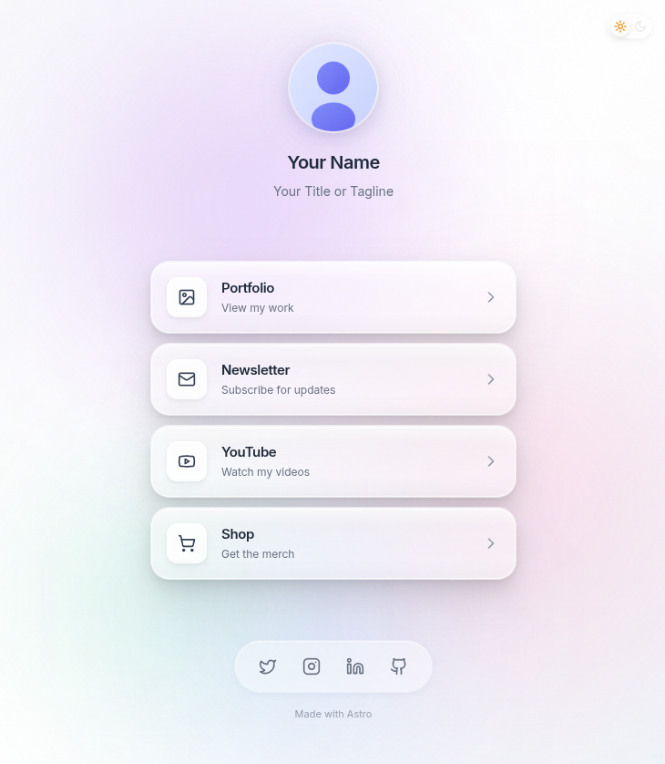
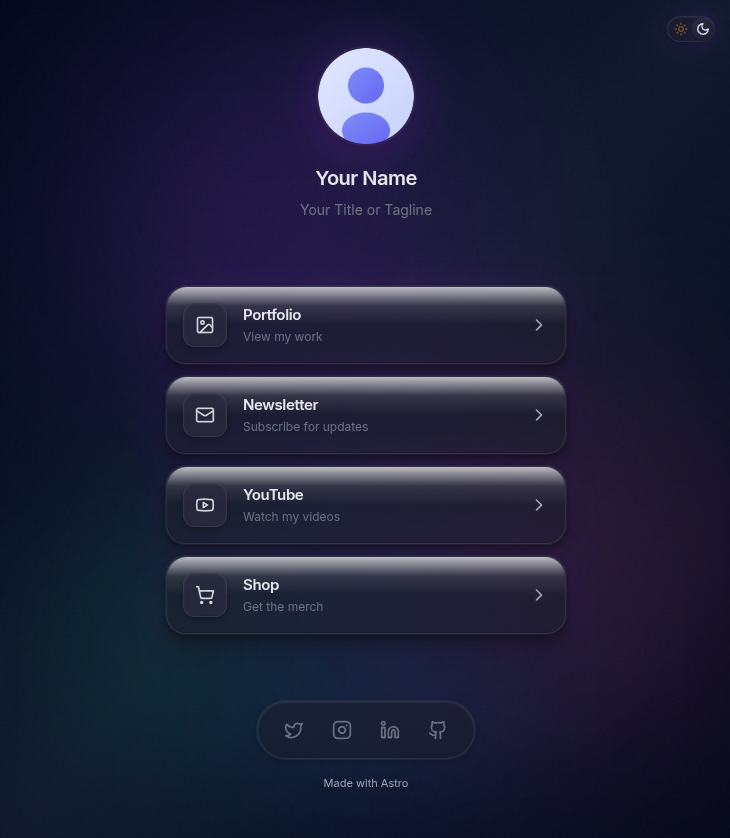

# Astro Link-in-Bio Template

A polished, performant link-in-bio page built with Astro 6, Tailwind CSS v4, and pure CSS glassmorphism effects. It keeps the runtime light while still delivering theme switching, rich metadata, and a flexible layout for creators.


---

## Preview

| Light Mode | Dark Mode |
|:----------:|:---------:|
|  |  |

---

## Features

- Glassmorphism cards with layered shadows and backdrop blur
- Light and dark mode with system preference detection and manual toggle
- Animated gradient-orb background and staggered entrance effects
- Responsive layout tuned for mobile-first presentation
- SEO metadata, Open Graph tags, Twitter cards, and JSON-LD
- Content Security Policy headers for safer defaults
- Astro image optimization for the profile asset
- Minimal JavaScript footprint

---

## Requirements

- Node.js 22.12.0 or newer
- pnpm 10 or newer

The repo includes an `.nvmrc` file pinned to `22.12.0`.

---

## Quick Start

```bash
git clone https://github.com/your-username/astro-link-in-bio.git
cd astro-link-in-bio
pnpm install
pnpm dev
```

Open [http://localhost:4321](http://localhost:4321) in your browser.

---

## Customization

### Profile

Edit `src/config.ts` for your site title, profile name, bio, links, and social accounts.

Replace `src/assets/profile.svg` with your own image if you want a custom avatar.

### Layout and Metadata

Edit `src/layouts/Layout.astro` to adjust metadata, fonts, CSP behavior, or theme bootstrapping.

Set the `SITE_URL` environment variable in production so canonical URLs and social metadata point to your real domain.

### Styles

Edit `src/styles/globals.css` to customize the palette, glass effects, motion, and background orbs.

---

## Deployment

### Cloudflare Workers Static Assets

This template is configured for [Cloudflare Workers Static Assets](https://developers.cloudflare.com/workers/static-assets/), so you can deploy the generated `dist` output directly from Wrangler.

1. Install dependencies:

```bash
pnpm install
```

2. Authenticate with Cloudflare:

```bash
pnpm exec wrangler login
```

3. Build and deploy:

```bash
pnpm build
pnpm exec wrangler deploy
```

You can also use:

```bash
pnpm deploy
```

Current `wrangler.jsonc`:

```jsonc
{
  "$schema": "./node_modules/wrangler/config-schema.json",
  "name": "astro-link-in-bio",
  "compatibility_date": "2026-04-29",
  "assets": {
    "directory": "./dist"
  }
}
```

### Other Platforms

| Platform | Command |
|----------|---------|
| Vercel | `npx vercel` |
| Netlify | `netlify deploy --prod` |
| GitHub Pages | Use the `@astrojs/github` adapter |

---

## Project Structure

```text
|- src/
|  |- pages/
|  |  `- index.astro
|  |- layouts/
|  |  `- Layout.astro
|  |- components/
|  |  |- LinkBioPage.astro
|  |  |- ThemeToggle.astro
|  |  |- ProfileSection.astro
|  |  |- LinkCard.astro
|  |  `- SocialFooter.astro
|  |- assets/
|  |  `- profile.svg
|  `- styles/
|     `- globals.css
|- public/
|- astro.config.mjs
|- wrangler.jsonc
`- package.json
```

---

## Commands

| Command | Description |
|---------|-------------|
| `pnpm dev` | Start the development server |
| `pnpm build` | Build the production site into `dist/` |
| `pnpm preview` | Preview the production build locally |
| `pnpm deploy` | Build and deploy with the local Wrangler dependency |

---

## License

MIT License - feel free to use this template for personal or commercial projects.
